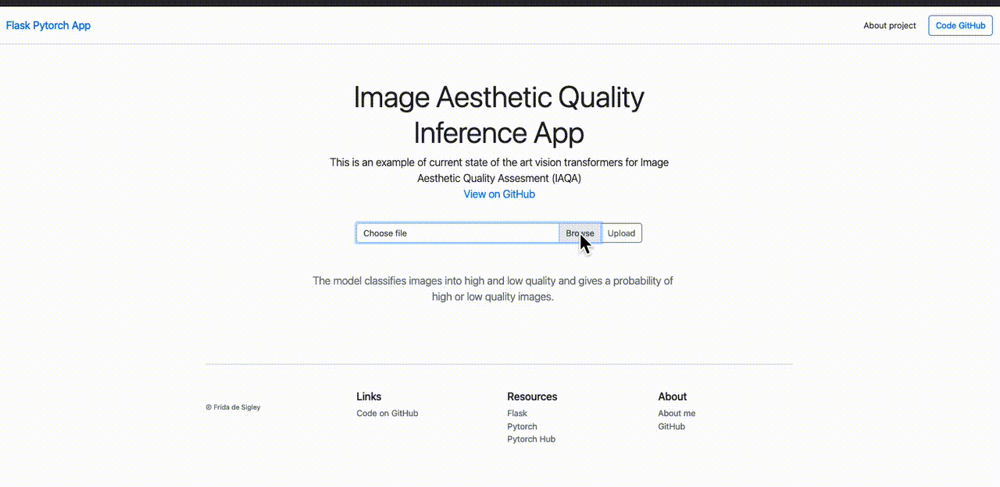

# Image Aesthetic Quality Assessment (IAQA)  web gui app and api (for remote inference)
### Currently under development
### Flask/PyTorch  Web app/api for image quality assessment inference




to set up virtual environment for project: 

```bash
pyenv virtualenv 3.9.5 app_env
pyenv activate app_env
pip install -r requirements.txt
```

to run app:

```bash
pyenv activate app_env
python app.py

```

### Container:

 Docker image of app can be found [here  
](https://hub.docker.com/repository/docker/fdsig/iaqa-app)  

### Resources:

[torch](https://pytorch.org/tutorials/recipes/deployment_with_flask.html)

[flask](https://flask.palletsprojects.com/en/2.0.x/)

[model](https://drive.google.com/file/d/1-Mc5OwRtQfCEqqo7_fnCpzpJ7gFhohQp/view?usp=sharing)

**To do**

- [x] set up basic template (local)
- [x] test local with model ConViT Base
- [x] fix initial bugs around missing file 
- [ ] set default images to try
- [ ] set classification to bool (high = True/False)
- [ ] create API in addition to GUI
- [ ] save images folder
- [ ] handle errors in file types/type checking and missing files
- [ ] deploy within docker

apologies for typos README.md may have been edited in vim/or on the fly.
